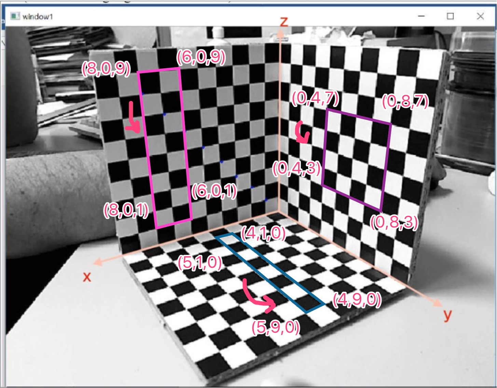

# 单目相机标定

SingleCamera类的C++版本实现了相机标定的主要步骤。在相机标定中，我们需要找到相机内部矩阵和外部矩阵，以及相机与世界坐标系之间的转换矩阵。这个类的主要作用就是计算这些矩阵。

SingleCamera类有三个需要输入的变量：world_coor，pixel_coor和point_num，分别存储世界坐标、像素坐标和点数。类中包含了几个成员函数，包括：  
composeP()：生成矩阵P，将其转换为合适的形式，以使得Pm=0。  
svdP()：对矩阵P进行奇异值分解，得到M=[A b]。  
workInAndOut()：通过M计算相机内参矩阵K和外参矩阵[R t]。  
selfcheck()：用于验证生成内参外参是否正确。  
SingleCamera类可以通过调用上述函数来计算相机的内外参数，从而对相机进行标定。可以使用selfcheck()函数验证计算出的转换矩阵是否正确。  

该示例选取网络上的一个立体标定物图片
虽然没有真正的摄像机标定装置，但是可以假设每个小方块的长度和宽度都是单位长度。这与摄像机标定原理并不违背。

本次作业需要大家根据课程讲解的算法实现相机标定的功能，在main函数中，已经提前定义了标定板上的三维坐标'w_coor'和三维坐标在二维图像上对应的角点'c_coor'。  
需要进行实现的是 `composeP`, `svdP`, `workInAndOut`, `selfcheck`四个函数，具体的要求在代码的注释中进行了说明。  

作业的最终形式需要大家将上传代码和标定结果的报告。